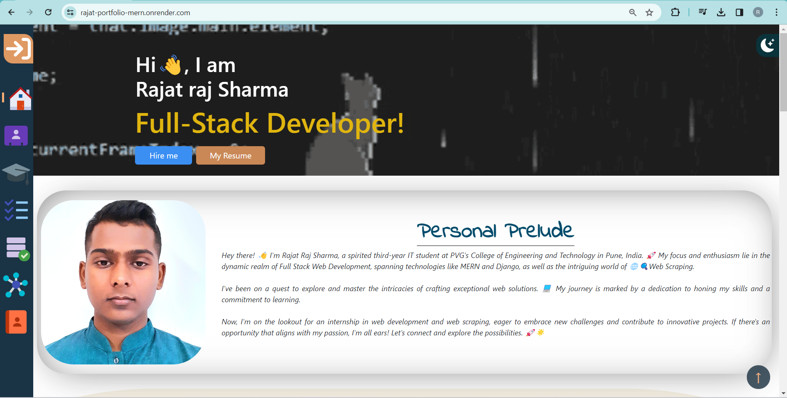

# Rajat Portfolio (MERN)

Welcome to my MERN (MongoDB, Express.js, React, Node.js) portfolio website repository! This portfolio showcases my skills, projects, and provides an overview of my professional background.

## Website Link

Visit the live portfolio: [Rajat Portfolio MERN](https://rajat-portfolio-mern.onrender.com/)

## Video Demo

Click on the image above to watch the demo video.

## Features

- **Responsive Design:** The website is designed to be responsive and looks great on various devices and screen sizes.

- **Email Sending:** The contact form allows visitors to send emails directly to your specified email address.

- **WhatsApp Integration:** For a seamless hiring process, there is a redirection to WhatsApp, making it easy for potential employers to reach out.

- **Web3form Integration:** Utilizes Web3form for form handling, providing a convenient and secure way to manage form submissions.

- **Bootstrap Framework:** The website is built using the Bootstrap framework, ensuring a clean and modern design.

## Technologies Used

- MongoDB: Database for storing portfolio data.
- Express.js: Backend framework for handling server-side logic.
- React: Frontend library for building the user interface.
- Node.js: Runtime environment for running server-side JavaScript.
- Web3form: Form handling service for managing contact form submissions.
- Bootstrap: CSS framework for building responsive and stylish web pages.
